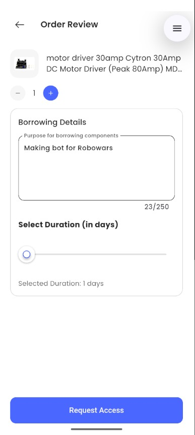
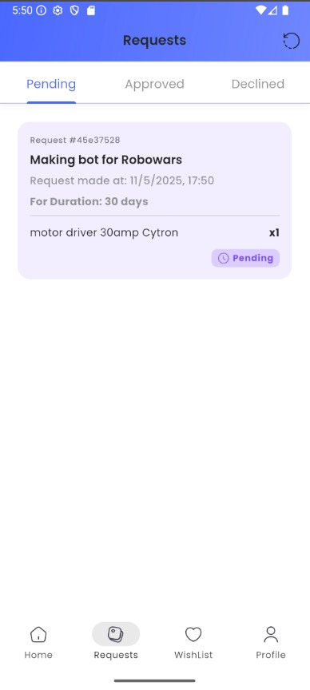
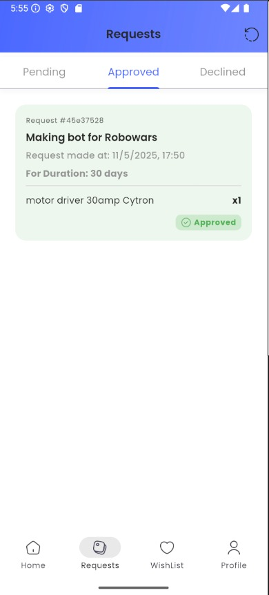
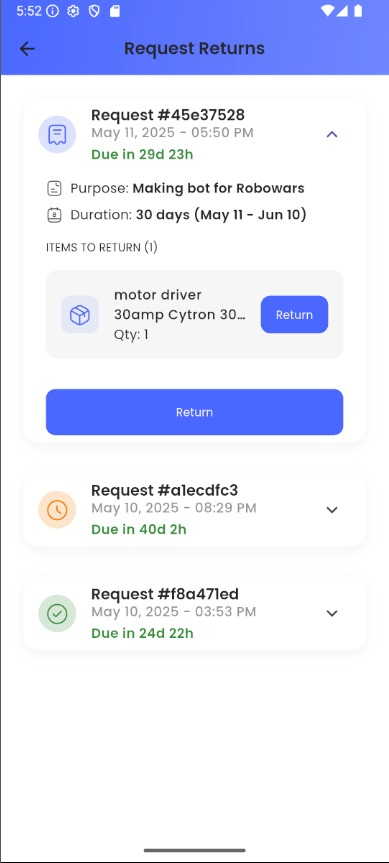
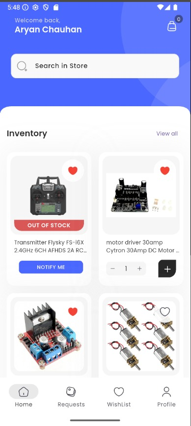

# 📦 Inventory Management App (Flutter + Firebase)

A feature-rich **IRL Inventory Management** built using **Flutter**, designed to simplify the process of **requesting and returning electronic components**.This system ensures efficient resource allocation, accountability, and real-time database updates.

---

## 🚀 Overview

This app streamlines the borrowing and returning process for electronic components by:
- Allowing users to request components by specifying a purpose and duration.
- Enabling real-time updates in inventory.
- Offering a full approval workflow for admins.
- Supporting return tracking and due date management.

Whether you're managing a university robotics lab or running a small hardware lending service, this app helps you stay organized and transparent.

---

## 📱 Key Features

### 🔎 1. Browse Inventory
- View all available components with images and names.
- Out-of-stock items are clearly marked.
- Add items to your **wishlist** for future access.
- Adjust quantity using "+" and "–" buttons.

### 📤 2. Component Request Workflow
- Select components from the inventory.
- Fill in the **borrowing purpose** (e.g., "Making bot for Robowars").
- Choose the **duration** for which the item is needed using a slider.
- Submit request via **"Request Access"** button.

### 🕒 3. Track Request Status
- Requests are categorized into:
  - **Pending** – Awaiting admin approval.
  - **Approved** – Ready to collect/use.
  - **Declined** – Not approved with reason (coming soon).
- Users can view timestamp, duration, and component details for each request.

### 🔁 4. Manage Returns
- See all borrowed items with:
  - Due dates
  - Request details
- Return individual items or all at once.
- Color-coded urgency indicators (e.g., due in green, overdue in red – optional future feature).

---

## 🛠️ Tech Stack

| Technology      | Purpose                                  |
|-----------------|-------------------------------------------|
| **Flutter**     | Cross-platform mobile app development     |
| **Firebase**    | Backend services (Firestore, Auth, Storage) |
| **Cloud Firestore** | Realtime database for tracking requests |

---

## 🧑‍💼 User Roles

### 👨‍🔬 Regular Users
- Browse inventory
- Request items with purpose and duration
- Track status and manage returns
- Add items to wishlist

### 👨‍💻 Admins (future module or backend panel)
- View incoming requests
- Approve/decline with reasoning
- Update stock levels
- Manage return confirmations

---

## 🎯 Use Case Example: Robowars Bot Building

Let’s say a student team is preparing a robot for a **Robowars competition**:
1. They request components like:
   - Motor drivers (e.g., 30Amp Cytron)
   - ESCs
   - Servo motors
2. Mention the purpose: *“Making bot for Robowars”*
3. Select 30 days as borrowing period.
4. Submit and wait for admin approval.
5. Return the item via the **Returns** section before the deadline.

---

## 📸 UI Preview (Screenshots)

> *(Place your screenshots inside a `/screenshots` folder in the repo)*

```markdown
### Order Review Page


### Pending Request Status


### Approved Request Display


### Return Management


### Inventory Browsing

